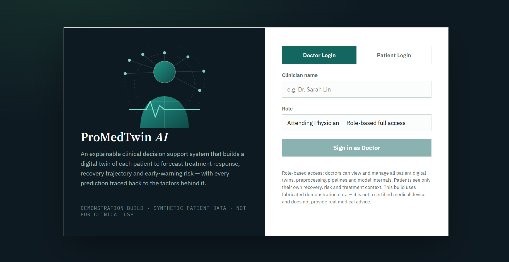
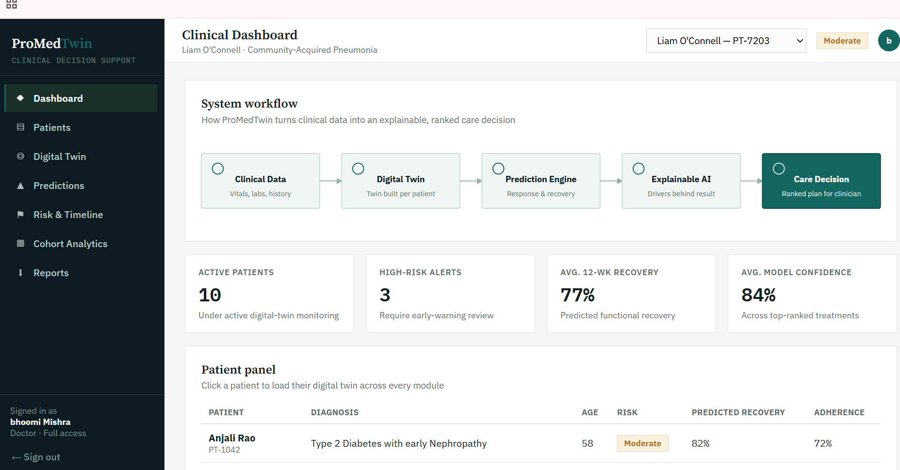
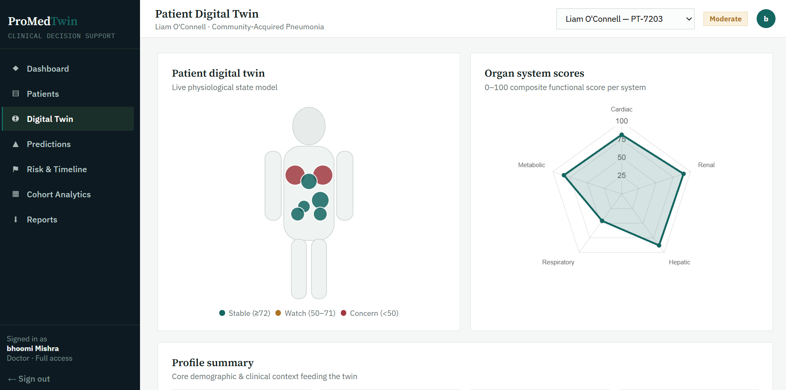
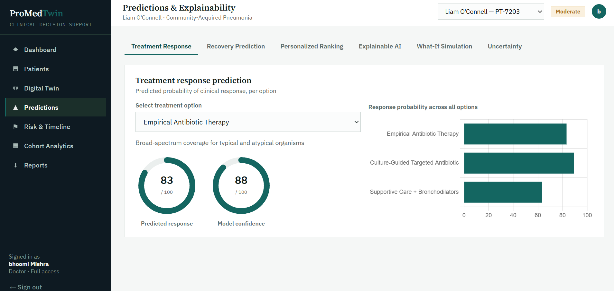
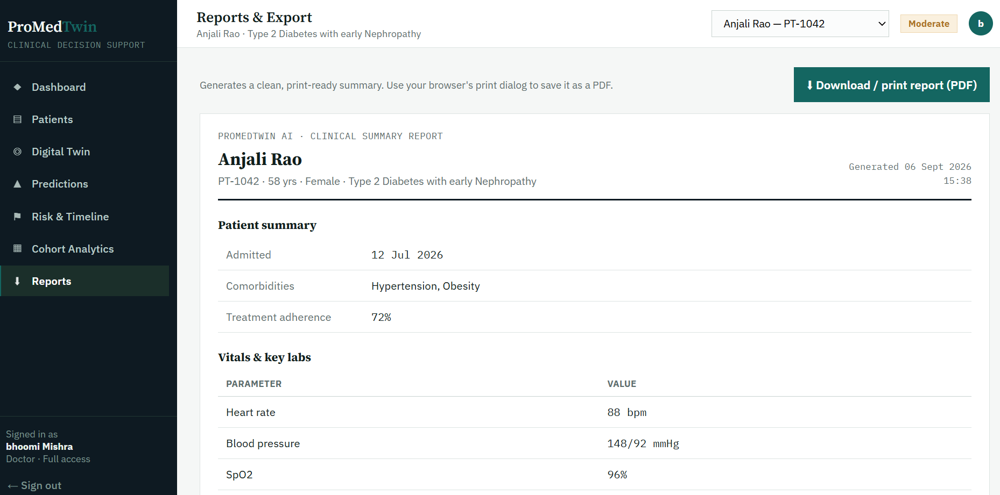

# ProMedTwin AI

An explainable clinical decision support demo: patient digital twins, treatment
response & recovery prediction, XAI, what-if simulation, risk monitoring,
cohort analytics, and PDF-style patient reports.

All data is synthetic. This is a demonstration build, not a certified medical
device.

## Screenshots

### Login / Authentication

### Dashboard

### Digital Twin

### Predictions & Explainable AI

### Risk & Early Warning / Timeline

### Cohort Analytics

### Reports & PDF Export

## Files

- `index.html` — the entire application (HTML/CSS/JS). Fully static, no
  build step, no backend, no API keys required.

## Run locally

Just open `index.html` in a browser, or use a simple local server / VS Code's
Live Server extension. Everything works client-side.

## Deploy anywhere

Since this is a single static HTML file with no server-side dependencies,
it deploys the same way on any static host:

- **Netlify**: drag the file onto app.netlify.com/drop
- **Vercel**: `vercel` from the folder containing `index.html`
- **GitHub Pages**: commit `index.html` to a repo, enable Pages in repo settings
- **Any other static host** (Cloudflare Pages, S3, Surge, etc.): just upload it

No environment variables, no serverless functions, no `package.json` needed.

## Notes

- Patient records added through the UI persist via `window.storage`, which is
  only available inside Claude.ai. Outside of it, newly added patients won't
  persist across page reloads — everything else works identically.
- The AI Assistant module was removed from this build to keep the app fully
  static with no backend dependency.
